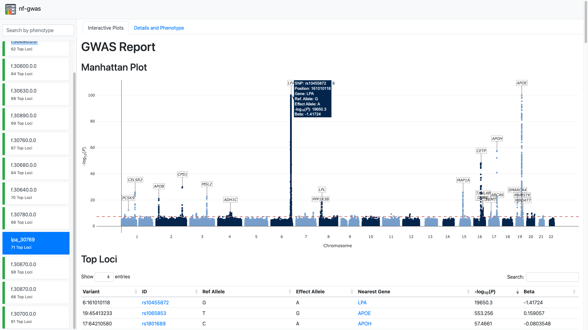

# nf-gwas

[](https://github.com/genepi/nf-gwas/actions/workflows/ci-tests.yml)
[](https://github.com/askimed/nf-test)

**nf-gwas** is a Nextflow pipeline to run biobank-scale genome-wide association studies (GWAS) analysis. The pipeline automatically performs numerous pre- and post-processing steps, integrates regression modeling from the REGENIE package and currently supports single-variant, gene-based and interaction testing. All modules are structured in sub-workflows which allows to extend the pipeline to other methods and tools in future. nf-gwas includes an extensive reporting functionality that allows to inspect thousands of phenotypes and navigate interactive Manhattan plots directly in the web browser. 

The pipeline is tested using the unit-style testing framework [nf-test](https://github.com/askimed/nf-test) and includes a [schema definition](nextflow_schema.json) to run with **Nextflow Tower**.



## Documentation

Documentation can be found [here](https://genepi.github.io/nf-gwas/).


## Citation

Please cite [our paper](https://academic.oup.com/nargab/article/6/1/lqae015/7602818) if you use nf-gwas:

> Schönherr S*, Schachtl-Riess JF*, Di Maio S*, Filosi M, Mark M, Lamina C, Fuchsberger C, Kronenberg F, Forer L. 
> Performing highly parallelized and reproducible GWAS analysis on biobank-scale data. 
> NAR Genom Bioinform. 2024 Feb 7;6(1):lqae015. doi: 10.1093/nargab/lqae015. PMID: 38327871; PMCID: PMC10849172.


## Quick Start

1. Install [Nextflow](https://www.nextflow.io/docs/latest/getstarted.html#installation) (>=22.10.4)

2. Run the pipeline on a test dataset

```
nextflow run genepi/nf-gwas -r v1.0.9 -profile test,<docker,singularity,slurm,slurm_with_scratch>
```

3. Run the pipeline on your data

```
nextflow run genepi/nf-gwas -c <nextflow.config> -r v1.0.9 -profile <docker,singularity,slurm,slurm_with_scratch>
```

Please click [here](tests) for available test config files.

## Development

```
git clone https://github.com/genepi/nf-gwas
cd nf-gwas
docker build -t genepi/nf-gwas . # don't ignore the dot
nextflow run main.nf -profile test,development
```

## nf-test

nf-gwas makes use of [nf-test](https://github.com/askimed/nf-test), a unit-style test framework for Nextflow.

```
cd nf-gwas
curl -fsSL https://code.askimed.com/install/nf-test | bash
./nf-test test
```

## License

nf-gwas is MIT Licensed and was developed at the [Institute of Genetic Epidemiology](https://genepi.i-med.ac.at/), Medical University of Innsbruck, Austria.

## Contact

- [Sebastian Schönherr](mailto:sebastian.schoenherr@i-med.ac.at)
- [Lukas Forer](mailto:lukas.forer@i-med.ac.at)
- [Johanna Schachtl-Riess](mailto:johanna.schachtl-riess@i-med.ac.at)
- [Silvia Di Maio](mailto:silvia.di-maio@i-med.ac.at)
