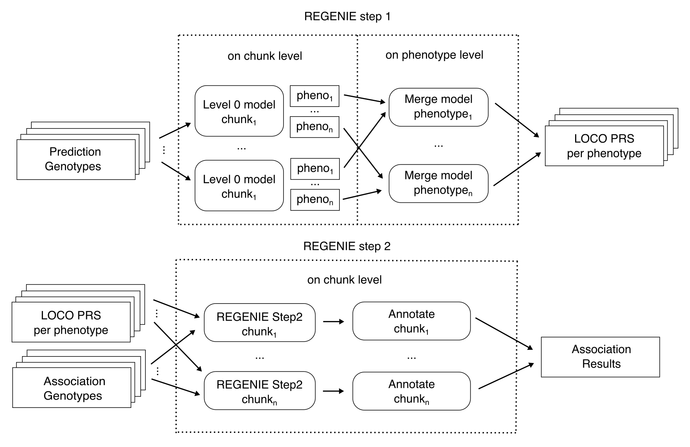
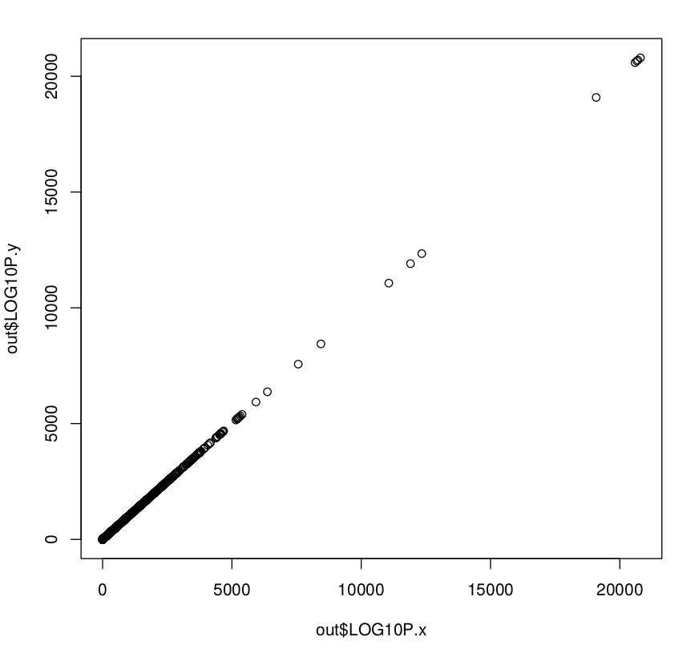

## FAQ

**What steps are performed by nf-gwas?**

Input files are on the left side and output files on the right side. The color defines the type of mode. Optional steps are marked in gray.

**How is REGENIE executed in parallel?**

Prediction genotypes (Step 1 Level 0) are first run on a user-defined chunk level and calculated predictions are then merged by phenotype in parallel. Step 2 (association of genotypes with phenotypes) and annotation is performed in parallel for all association genotype chunks in combination with the LOCO predictions. Afterwards, annotated association results are merged per phenotype and all post-processing steps within the pipeline are performed in parallel for all phenotypes (not shown).

**How are VCF files converted to work with REGENIE?**

Michigan Imputation Server writes output files in VCF.GZ format. To enable VCF support in combination with regenie, we convert VCF files into the PGEN format. Please note that VCF files cannot be losslessly converted to BGEN.

To validate our approach, we run two GWA studies using (a) the original UK Biobank BGEN files and (b) VCF files created from the original BGEN files as an input (used command: `plink2 --bgen ukb_imp_chr6_v3.bgen ref-first --sample ukbXXX.sample --export vcf-iid bgz vcf-dosage=DS`).

The plot below shows that LOGP10 values between the two executions highly correlate.

