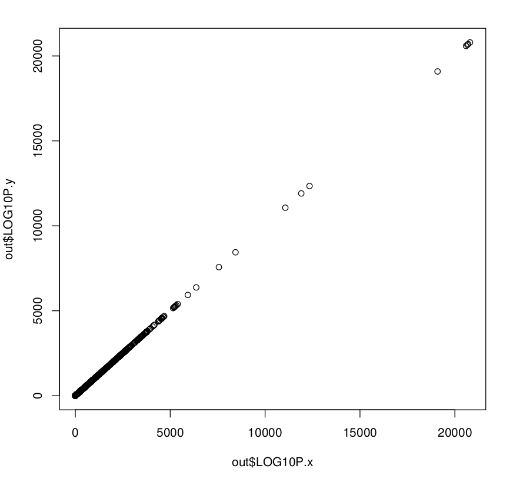

## FAQ

**How are VCF files converted to work with regenie?**

Michigan Imputation Server writes output files in VCF format. To work with regenie, we convert VCF files into the PGEN format. Please keep in mind that PLINK2 cannot losslessly convert from VCF to BGEN.

To verify this conversion, we run a GWAS using (a) the original UK Biobank BGEN files and (b) VCF files created from the original BGEN files (`plink2 --bgen ukb_imp_chr6_v3.bgen ref-first --sample ukbXXX.sample --export vcf-iid bgz vcf-dosage=DS`).

The plot below shows that LOGP10 values between the two executions correlate.

